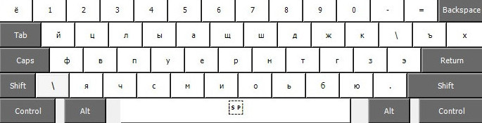
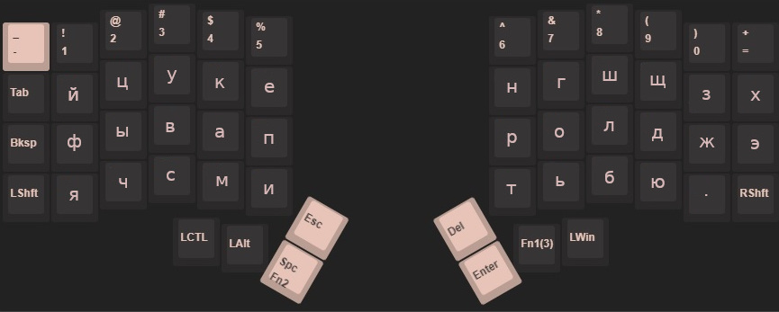

# iris-colemak-ru
<br />

<p align=center><b>Русская раскладка для <a href="https://github.com/tagirov/iris-colemak">iris-colemak</a></b></p>
<br />
<br />

Colemak используется на уровне прошивки, поэтому дефолтное расположение кириллицы становится такое:
<br />


<br />

Фактически получаем это:
<br />


<br />

# Установка

### На Линуксах
<br />

```
git clone https://github.com/tagirov/iris_colemak_ru && cd iris_colemak_ru
```
<br />

Бекапим старые файлы

```
cp /usr/share/X11/xkb/rules/evdev.xml /usr/share/X11/xkb/rules/evdev.xml.backup
cp /usr/share/X11/xkb/symbols/ru /usr/share/X11/xkb/symbols/ru.backup
```
<br />

Заменяем

```
cp ./evdev.xml /usr/share/X11/xkb/rules/evdev.xml
cp ./ru /usr/share/X11/xkb/symbols/ru 
```
<br />


Прописываем в xinit (или выбираем в настройках своего окружения)

```
echo 'setxkbmap -layout us,ru -variant ,iris_colemak_ru, -option grp:alt_shift_toggle' >> $HOME/.xinitrc
```
<br />

### На Форточках
<br />

Распаковываем `iris_colemak_ru_win.zip` и запускаем `setup.exe`. В меню выбора раскладки выбираем "Russian Iris"

<br />

Если надо другой конфиг, скармливаем `iris_colemak_ru_win_model.klc` в [MSKLC](https://www.microsoft.com/en-us/download/details.aspx?id=102134)
<br />
<br />


# Доп.сведения
<br />

ъ на втором слое, на кнопке "]"

ё на втором слое, на кнопке "u"
